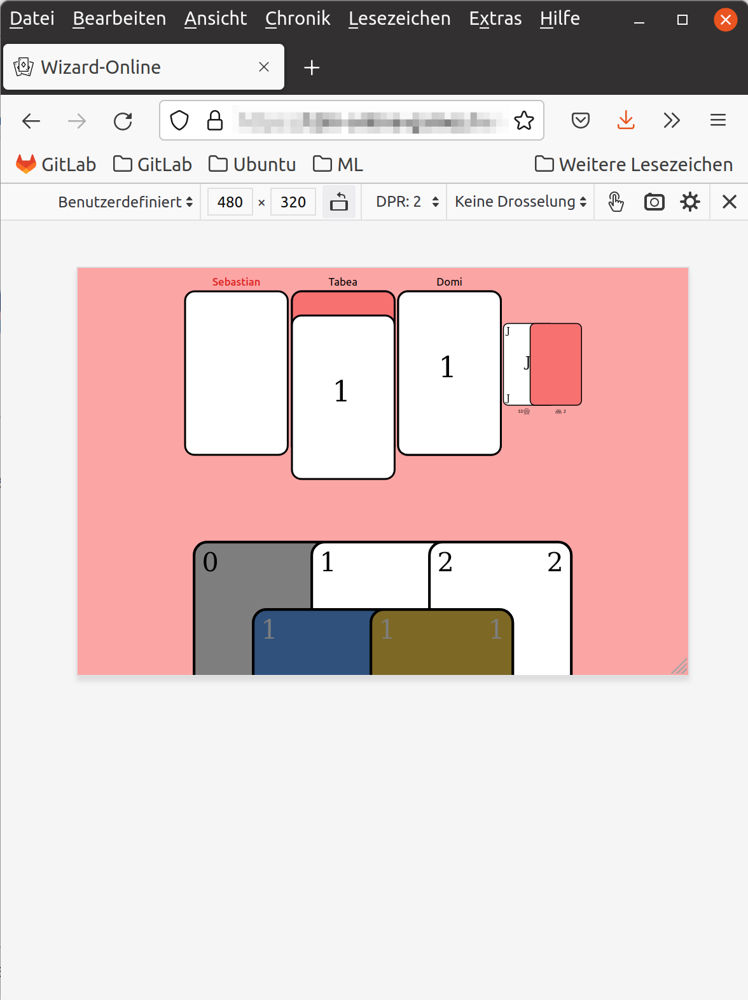

# Wizard-Online

Diese Anwendung ermöglicht es, das Kartenspiel [Wizard](https://de.wikipedia.org/wiki/Wizard_(Spiel)) mit mehreren Spielern gemeinsam über das Internet zu spielen. Wizard ist ein Kartenspiel, ein Stichspiel, bei welchem Wahrscheinlichkeiten die Strategie bestimmen. Das Spiel ist auch für Mobilgeräte optimiert und erhält ein eigenes Matchmaking-System.

## Screenshots
### Startseite

### Matchmaking

### Erste Runde

### Zweite Runde

### Mobile Ansicht

### Ergebnis-Bildschirm
